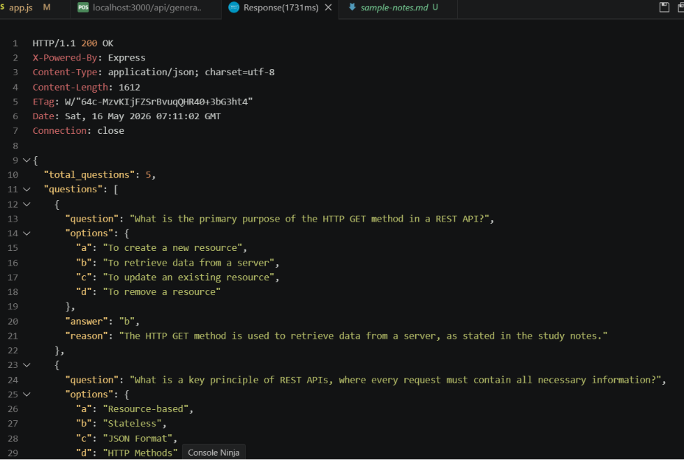
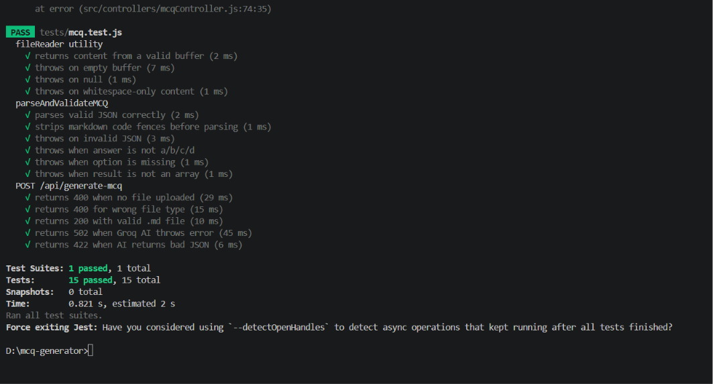

# AI MCQ Generator API

An AI-powered REST API that automatically generates Multiple Choice Questions (MCQs) from uploaded Markdown study notes using Large Language Models (LLMs).

The system accepts `.md` files, extracts the content, sends it to an AI model, and returns structured exam-style MCQs in JSON format.

This project was developed as part of the **Phase 01 – AI MCQ Generator API Intern Development Task**.

---

#  Features

- Upload Markdown (`.md`) files
- Extract text content from uploaded notes
- Generate AI-powered MCQs
- Structured JSON response
- REST API architecture
- Error handling and validation
- AI integration using GroqCloud API
- Unit and integration testing
- Modular backend architecture

---

#  Tech Stack

| Tool       | Purpose                        |
|------------|--------------------------------|
| Node.js    | JavaScript runtime             |
| Express.js | Web framework and routing      |
| Groq AI    | LLaMA 3.3 70B — MCQ generation |
| Multer     | Handles `.md` file uploads     |
| dotenv     | Manages environment variables  |
| Jest       | Unit testing framework         |
| Supertest  | API integration testing        |

---

#  Project Structure

```txt
mcq-generator/
│
├── src/
│   ├── config/
│   │     └── aiConfig.js
│   │
│   ├── controllers/
│   │     └── mcqController.js
│   │
│   ├── routes/
│   │     └── mcqRoutes.js
│   │
│   ├── services/
│   │     └── aiService.js
│   │
│   ├── utils/
│   │     └── fileReader.js
│   │
│   └── app.js
│
├── tests/
│   └── mcq.test.js
│
├── screenshots/
│   ├── api-response.png
│   └── test-results.png
│
├── sample-notes.md
├── test.http
├── .env
├── .gitignore
├── package.json
└── README.md
```

---

#  Installation

## 1. Clone the repository

```bash
git clone <repository-url>
cd mcq-generator
```

---

## 2. Install dependencies

```bash
npm install
```

---

#  Environment Variables

Create a `.env` file in the project root.

```env
PORT=3000
GROQ_API_KEY=your_groq_api_key
```

---

#  Running the Server

## Development Mode

```bash
npm run dev
```

## Production Mode

```bash
npm start
```

Server will run at:

```txt
http://localhost:3000
```

---

#  Usage

## Step 1 — Prepare your Markdown notes file

Create a `.md` file with your study notes.

### Example

```markdown
# REST API Fundamentals

REST stands for Representational State Transfer.
It uses HTTP methods like GET, POST, PUT and DELETE.

## Status Codes
- 200 OK — success
- 404 Not Found — resource missing
- 500 Internal Server Error — server failure
```

---

## Step 2 — Send a request using REST Client (VS Code)

Install the **REST Client** extension by Huachao Mao.

Open `test.http` and click **Send Request**.

```http
POST http://localhost:3000/api/generate-mcq
Content-Type: multipart/form-data; boundary=----Boundary

------Boundary
Content-Disposition: form-data; name="file"; filename="sample-notes.md"
Content-Type: text/markdown

< ./sample-notes.md

------Boundary--
```

---

## Step 3 — Or use curl in your terminal

```bash
curl -X POST http://localhost:3000/api/generate-mcq \
  -F "file=@sample-notes.md"
```

---

#  API Reference

## POST /api/generate-mcq

| Property      | Value               |
|---------------|---------------------|
| Method        | POST                |
| Endpoint      | /api/generate-mcq   |
| Body Type     | multipart/form-data |
| Field Name    | file                |
| Accepted Type | `.md` files only    |
| Max File Size | 5MB                 |

---

#  Example Response

```json
{
  "total_questions": 5,
  "questions": [
    {
      "question": "What does REST stand for?",
      "options": {
        "a": "Remote Execution State Transfer",
        "b": "Representational State Transfer",
        "c": "Request State Technology",
        "d": "Resource Sharing Transfer"
      },
      "answer": "b",
      "reason": "REST stands for Representational State Transfer, an architectural style for networked applications."
    }
  ]
}
```

---

#  Response Fields

| Field           | Type   | Description                        |
|-----------------|--------|------------------------------------|
| total_questions | Number | Total number of questions returned |
| questions       | Array  | List of MCQ objects                |
| question        | String | MCQ question text                  |
| options         | Object | Four options labeled a, b, c, d    |
| answer          | String | Correct option key (`a/b/c/d`)    |
| reason          | String | Explanation of the correct answer  |

---

#  AI Prompt Strategy

The backend sends uploaded notes to the AI model using a structured prompt.

### Prompt Responsibilities

- Generate MCQs from notes
- Provide four meaningful options
- Include one correct answer
- Provide explanation/reason
- Return strictly valid JSON format

---

#  Testing

Run all unit and integration tests:

```bash
npm test
```

### Test Coverage

- API endpoint testing
- File upload validation
- AI service testing
- File reader utility testing

---

#  Error Reference

| Status | Error                 | Cause                                |
|--------|-----------------------|--------------------------------------|
| 400    | Bad Request           | No file, wrong file type, empty file |
| 422    | Unprocessable Entity  | AI returned malformed JSON           |
| 429    | Too Many Requests     | Groq API rate limit reached          |
| 502    | Bad Gateway           | Groq service error or invalid key    |
| 500    | Internal Server Error | Unexpected server-side failure       |

---

#  Output Preview

## API Response



---

## Test Results



---

#  API Testing Tools

This project is tested using:

- REST Client Extension (VS Code)
- Thunder Client

---

#  Future Improvements

- Difficulty level selection
- Dynamic MCQ count
- Authentication and rate limiting
- Database integration
- Frontend dashboard
- PDF and DOCX support
- Export MCQs as PDF

---

#  Author

Developed as part of the **Phase 01 Intern Development Program**.


---

> Built with Node.js + Groq AI 🚀
